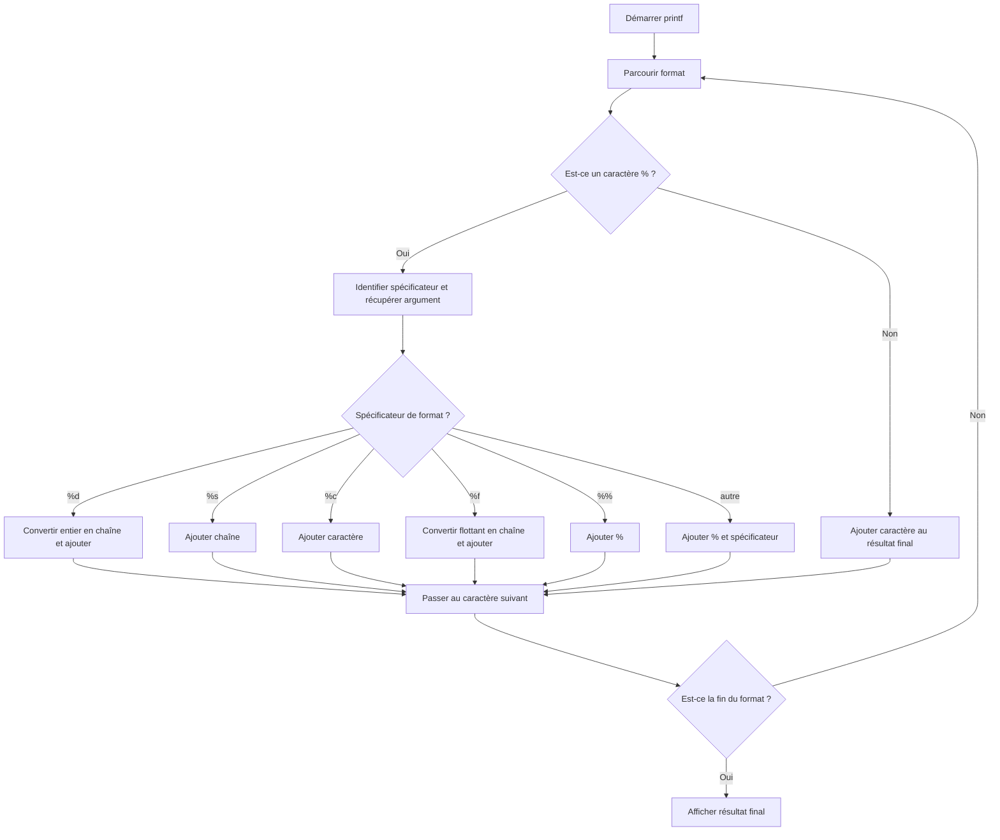

```mermaid
graph TD
    A[Démarrer printf] --> B[Parcourir format]
    B --> C{Est-ce un caractère % ?}
    C -->|Oui| D[Identifier spécificateur et récupérer argument]
    C -->|Non| E[Ajouter caractère au résultat final]
    D --> F{Spécificateur de format ?}
    F -->|%d| G[Convertir entier en chaîne et ajouter]
    F -->|%s| H[Ajouter chaîne]
    F -->|%c| I[Ajouter caractère]
    F -->|%f| J[Convertir flottant en chaîne et ajouter]
    F -->|%%| K[Ajouter %]
    F -->|autre| L[Ajouter % et spécificateur]
    G --> M[Passer au caractère suivant]
    H --> M
    I --> M
    J --> M
    K --> M
    L --> M
    E --> M
    M --> N{Est-ce la fin du format ?}
    N -->|Oui| O[Afficher résultat final]
    N -->|Non| B
```
