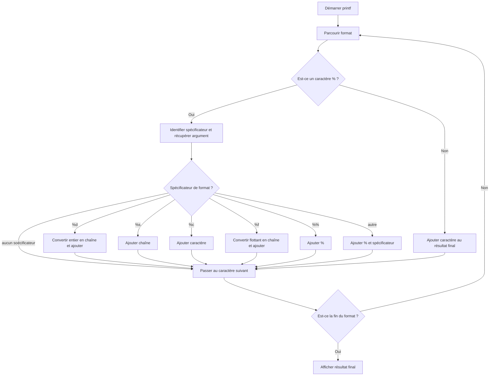

<div align="center">

</div>

The project to create a `printf` function consists of reimplementing this standard function in C, which allows formatted data to be displayed on standard output (usually the console). The goal is to recreate a simplified version of `printf` without using the standard `<stdio.h>` library and its built-in functions.
### Table of Contents
1. Introduction
2. Requirements
3. Installations
4. Usages
5. Authors
### Requirements

1. **Éditeur de texte ou IDE :** Pour écrire et compiler votre code C, vous pouvez utiliser des éditeurs comme `vim`, `nano`
2. Install minimun Ubuntu 20, github
### installations
1. Clone this github
```
https://github.com/mrfouu/holbertonschool-printf
```
2. Command compilation _printf source file
```
gcc -Wall -Werror -Wextra -pedantic -std=gnu89 -Wno-format *.c
```
3. si besoin d'aide faite
```
man man_3_printf
```
## Macro and functions allowed :white_check_mark:
`write`
`malloc`, `free`
`va_start`, `va_end`, `va_copy`, `va_arg`
### Test
```

#include <stdio.h>
#include <string.h>
#include "main.h"

int main(void)
{
        _printf("hello C25\n");
        _printf("i don't have %d iphone\n",10);
        _printf("my name is not  %s\n", "Athur");
        _printf("I have %i laughed at the final result which is equivalent to a %c\n", 50, 'C');
        _printf("let's go for 0 %%\n");
        return(0);
}
```

```
STDOUT
hello C25
i don't have 10 iphone
my name is not Arthur
I have 50 laughed at the final result wich is equivalent to a C
lets go for 0 %
```
### FLOWCHART



### Authors
Bryan Weinegaessel [](https://github.com/mrfouu)

Hugo Bailly [](https://github.com/hugo-b-fx)
